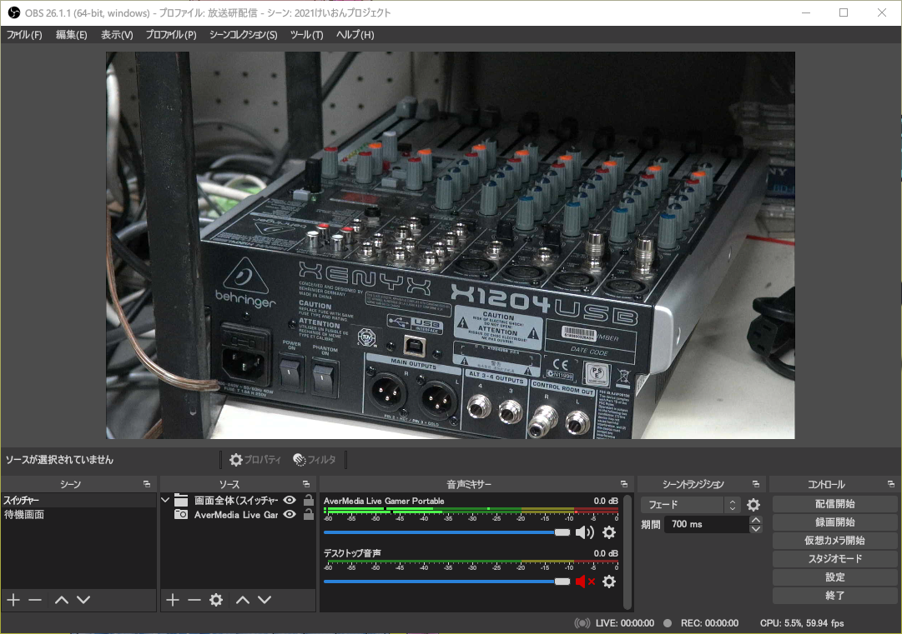

Broadcast  
2021/03/20作成

# OBS Studioでの配信

ここではOBS Studioの使い方，配信の仕方などを説明していきます。主に配信当日に行うものです。事前設定については[OBS Studioの設定](./OBSStudioSetting.md)をご覧ください。

## 概要

起動後の画面と，説明です。

  
**画像1：OBS Studio**

- **シーン**：スイッチャーのそれぞれのカメラ入力をソフト的に再現した物です。入力1，入力2，……と作っておき，ワンタッチで切替えられます。
- **ソース**：選択しているシーンを構成する映像や音声です。画像編集ソフトと同様にレイヤー構造になっており，上に書かれているソースが画面の上側に表示されます。
- **プロパティ**：選択しているソースの詳細設定ができます。
- **フィルタ**：選択しているソースに映像・音響効果をかけます。
- **音声ミキサー**：音声をミキシング（重ね合わせ）します。
- **シーントランジション**：シーンを切替えるときの切替え効果です。
- **コントロール**：各種操作ができます。
- （メニューバー）**プロファイル**：OBS Studioの状態を丸々保存・復元します。
- **シーンコレクション**：全てのシーンを保存・復元します。

