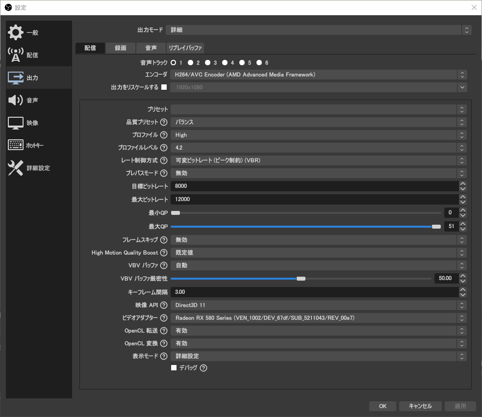
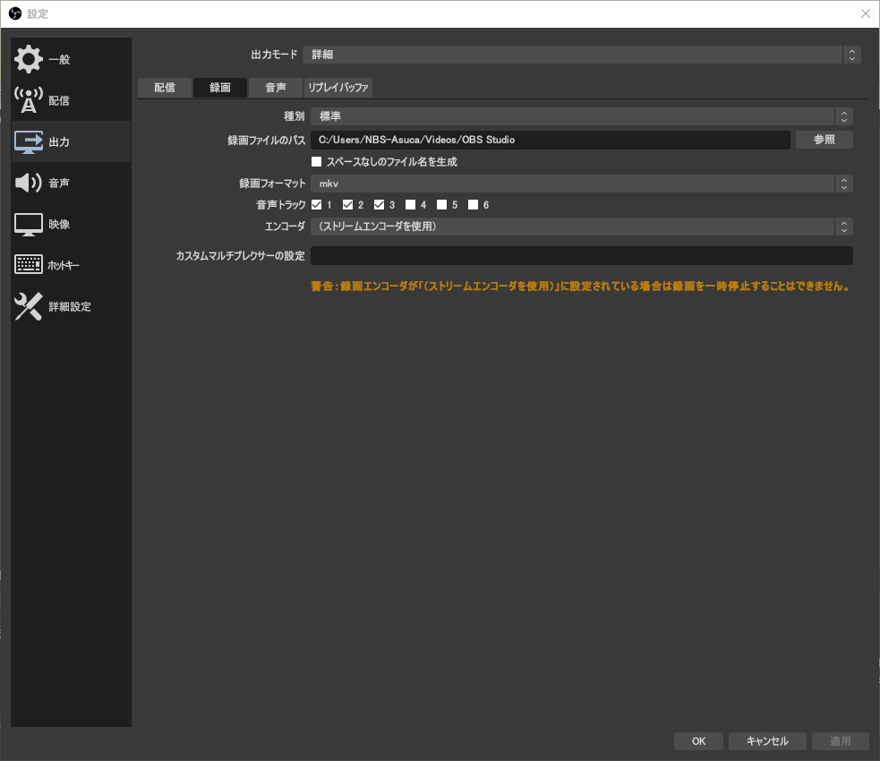
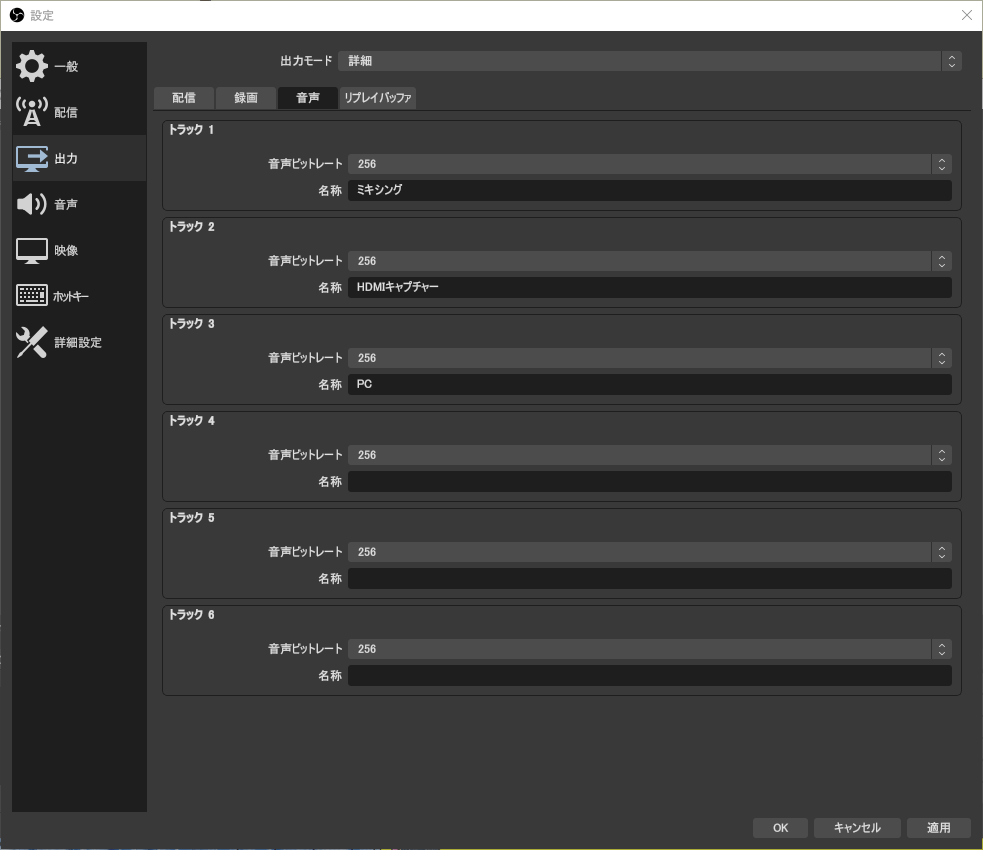
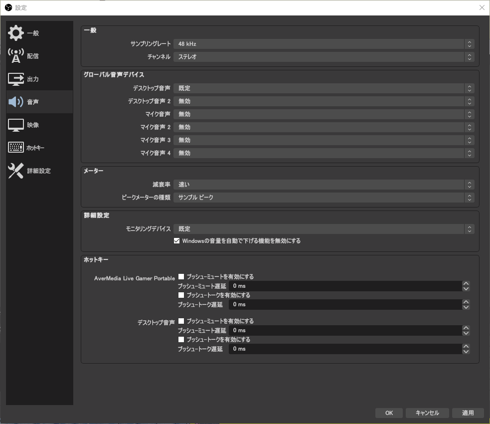
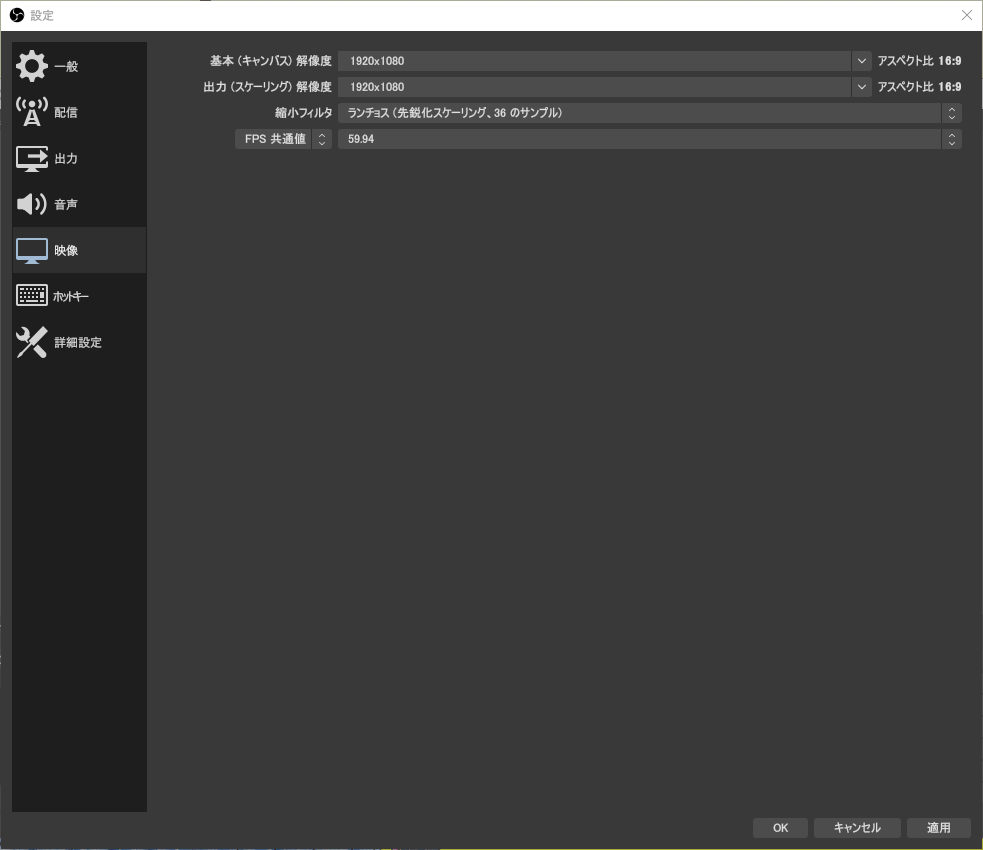
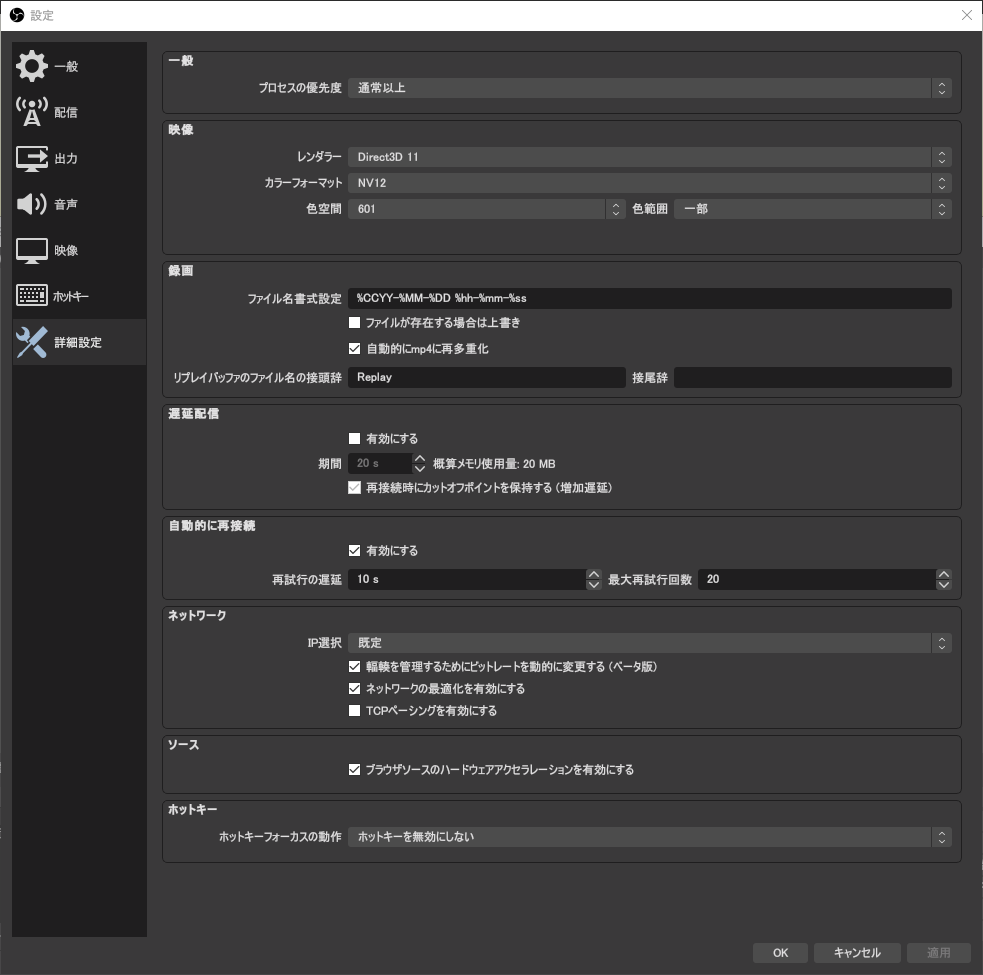

Broadcast  
2021/03/20作成

# OBS Studioの設定

ここではOBS Studioの事前設定（主に配信前日までにやっておくもの）について説明していきます。当日のことについては[OBS Studioでの配信](./OBSStudioBroadcast.md)をご覧ください。

なお，これまで放送技術研究会はXSplit Broadcasterを用いていましたが，仕様変更により大学のネットワークから認証が通らなくなってしまったため，2021年から試験的にOBS Studioを用いています。私個人としてはOBS Studioをバージョン0の頃使っており，その頃はかなり不安定だった印象がありますが，今では多くの配信者が用いるほど安定してきていますので，問題ないかと思います。また，放送技術研究会で行う配信では特にXSplitでしか使えない高度な機能は使わないため，今後OBS Studioを正式採用していいかと思います。

しかし，OBS StudioはXSplit Broadcasterに比べるとユーザーに不親切であったり，細かい設定が多いため（間違えると配信品質に悪影響），そのあたりや，なぜその設定にするのかといった歴史的経緯もこの記事で解説できたらと思います。なお，歴史的経緯は簡単に数式も添えていますが，信号処理の知識が必要なので，読み飛ばしてもらって構いません。

## 設定

OBS Studioを起動し，「設定」を開きます。

## 一般

開始を押したときに確認を出すかとか録画も一緒に開始するかとか，そういう系です。2021年現在，配信品質に関わる項目は一般の中に入ってないので，お好みでどうぞ。

## 配信

事前準備ではなく，配信するときに設定するものなので，省略。

## 出力

エンコードの設定です。

### 出力→配信

AMDのGPUがのったグラボを使っていて，1080/60pで配信する場合，次の画像のように設定してください。

  
**画像1：出力・配信**

- **音声トラック**：生配信する音声を選択します。分かりやすいようにここでは「1」（ミキシング後，[配信に関する記事](./OBSStudioBroadcast.md)で説明）を選択します。
- **エンコーダ**：「H.264」とお使いのグラボのGPUチップの会社名が入っているものを選択します（そうするとグラボの専用回路でエンコードするためコマ落ちしにくくなります）。
- **品質プリセット**：画面に表示されていない，速度と画質のトレードオフ関係にあるパラメーターをこのプリセットで設定します。生配信ではリアルタイムに処理しなければならないため，「品質」優先は向きません。「バランス」か「速度」優先にします。
- **プロファイル**：H.264の規格で定められた「プロファイル」のことです。使えるエンコードオプションが変わります。これは「High」以外にするメリットが特にないです。10年くらい前のモバイル機器はBaselineプロファイルでないと再生できませんでしたが，現在はスマホ等もHighプロファイルに対応し，また，そもそもYouTube等の配信サイトは送られてきた映像をそのまま視聴者に流さず，再エンコードするため，全く問題ありません。負荷についてもプロファイルを落とすよりもプリセットを速度優先にした方が良いです。
- **プロファイルレベル**：H.264の規格で定められた「レベル」のことです。レベルによって扱える解像度やビットレートが変わります。1080/60pは「4.2」以上で扱えます。ちなみに「プロファイル」も「レベル」も再生する前に負荷を見積り，再生できなさそうなら最初から再生しない，とするための物です。よって，1080/60pであるにも関わらずレベルを5や6にしてしまうとプレイヤーが勝手に4Kや8Kと勘違いし再生しない可能性がありますので，1080/60pは **「4.2」一択**と考えて問題ありません。1080/30pや720/60pは「4.1」です。  
※ 前述の通りYouTube等は再エンコードするため，5や6でも問題ありませんが，ローカルに録画したファイルを色々使うこともあると思うので。
- **レート制御方式**：固定ビットレート（CBR）はムダが多いので，基本は可変ビットレート（VBR）または平均ビットレート（ABR）にします。
- **プレパスモード**：本エンコードの前に解析し，高画質化します。しかし，その分遅延が増え，負荷が上がるため，生配信には向きません。**「無効」一択**です。
- **目標ビットレート**：名前の通り，目標とする情報速度（単位時間あたりの情報量）です。単位は k bits/秒（kbps）です。推奨値は[配信に関する記事](./OBSStudioBroadcast.md)で説明します。
- **最大ビットレート**：変動（可変）する情報速度（ビットレート）の最大値です。1080/60pで画質とネットワーク負荷のバランスが取れているのは10,000 kbps〜12,000 kbpsあたりです。
- **QP**：品質値（画質劣化度合い）の範囲を指定できます。その範囲の中で最も目標ビットレートに近くなるような品質値が選ばれます。生配信の場合，ネットワーク負荷を考えると完全にビットレートに合わせて自動調整してもらった方が良いため，0〜51または1〜51にします。ちなみに（生配信でなく録画の場合），目安として20以下は目立たない程度の劣化しかなく，20〜25は一時停止しないと分からない程度の劣化で，25〜30は再生中でも少し分かる程度の劣化，30以上は普通に気づく劣化です。よって，例えば最小QPを30にするとどんな映像でも（本来目標ビットレート未満の情報速度で画質を保てる場合でも）分かる程度の画質劣化が起こり，逆に最大QPを20にするとどんな映像でも（目標ビットレートを超える情報速度を出してでも）知覚できる程度の劣化が起こりません。
- **フレームスキップ**：瞬間的に最大ビットレートを超えてしまった場合にコマ落ちさせて最大ビットレート内に収めます。コマ落ちさせる＝少しの間映像が止まるということなので，**「無効」一択**です（相当ネットワークが厳しい場合は有効の方がいいかもしれませんが）。
- **High Motion Quality Boost**：（エンコードについては専門のつもりでしたが，AMDの独自機能なので私にも分かりません）
- **VBVバッファ**：VBV＝映像一時記憶領域検証です。動画を再生（デコード）する際，一時的にメモリに保存しますが，そのメモリの領域を指定し，そのメモリ領域で再生可能であることを検証します。手動での指定はとても難しいため（エンコードする映像の複雑度（細かさや動きの多さ）やネットワークの状態に合わせる必要あり，間違うと正しく再生できなくなる），**「自動」一択**です。VBVのBがバッファーのため，「VBVバッファ」って誤訳では？と思いましたが，英語でもVBV Bufferになってました。VBVのメモリ領域を指定する項目だよってことなんでしょうね。
- **VBVバッファ厳密性**：名前の通りです。Blu-rayなどの光学ディスクの場合，急激に回転速度を変えられないので，厳密に従ってないと再生が止まってしまうということがありますが，逆に生配信の場合，厳密に検証しているとエンコードが間に合わなくなり，配信ができなくなってしまいます。しかし，全く従わない（0にした）場合，それはそれで再生できなくなる可能性やネットワーク負荷が増えますので，バランスの取れた「50」前後がいいのではないでしょうか。
- **キーフレーム間隔**：MPEG系（H.264含む）の動画データは基準フレーム（1枚の完全な静止画）と，そこから動きを予測し，予測との差分を記録したフレームの2種類（厳密には予測フレームに2種類あるため合計3種類）があります。その基準フレームの間隔を指定します。通常は基準フレームよりも予測との差分フレームの方が少ない情報量で表現できるため画質劣化が起こりにくくなり，シーンの変わり目は予測との差分が大きくなるため基準フレームの方が適し，10秒以上基準フレームがない場合，予測の負荷が高くなります。この性質から最適値は3〜10秒となります（YouTubeは5秒以下を推奨しています）。また，基準フレームが来るまで再生開始できないため，基準フレームの間隔が長い場合，再生開始まで時間がかかるようになります（テレビがデジタル化し，チャンネル切替えに時間がかかるようになったのはこのため）。なお，大学内からYouTubeに配信する際は一度別のサーバーで変換をする関係で **必ず「3秒」**にしてください。
- **映像API**：APIはあるプログラムAと別のプログラムBの間で良い具合に情報伝達してくれる便利なプログラムのことです（この場合OBS Studioとエンコーダーをいい感じに繋いでくれる物）。ぶっちゃけ何でもいいです。Windowsで映像系はDirect3Dがよく使われてる印象です。
- **ビデオアダプター**：エンコードするグラボを選択します。グラボ1枚のPCは1つしかないので当然選択肢はありません。
- **OpenCL転送，OpenCL変換**：（私もよく分かってないですが，OpenCLを使うことでCPUとGPUによっては効率的に映像をやり取りできるようです）
- **表示モード**：この調整できるエンコードオプションの数を変えます。「基本」だと品質に影響のあるオプションを指定できず，「マスター」や「エキスパート」では間違えると映像がおかしくなってしまうオプションも調整する必要が出てくるため，「詳細」がオススメです。

### 出力→録画

  
**画像2：出力・録画**

- **録画ファイルのパス**：出力先のフォルダーを指定します。
- **録画フォーマット**：録画ファイルのコンテナ（映像と音声とその他メタデータを含めた構造）を指定します。1番優れているコンテナはMatroska（mkv）ですが，Premiere Proで読み込めないので，MPEG-2 Transport Stream（ts）を推奨します。MOVとMPEG-4（mp4）は仕様上，途中で止まってしまった場合に動画ファイルが壊れてしまうので非推奨です。
- **音声トラック**：出力する音声トラックを指定します。複数選択すると主音声，副音声のような形になります。
- **エンコーダ**：映像のエンコーダーを指定します。「（ストリームエンコーダを使用）」にすると，前述の「配信」の項目で指定したエンコーダーが使われ，配信と同時に録画する場合は配信した映像と全く同じデータが保存されます。それ以外を選択すると配信とは別に動画をエンコードし，負荷がとても高くなるため，**「（ストリームエンコーダを使用）」一択**と考えてもらってかまいません。
- **カスタムマルチプレクサーの設定**：マルチプレックス＝映像，音声など複数のソースをひとつのコンテナにまとめることです。ようするに，マルチプレックスの設定を自由記述できる項目です。特別な理由がなければ書く必要ありません。というか特別な理由があっても私には書き方が分かりません。

### 出力→音声

  
**画像3：出力・音声**

各トラックの情報速度（ビットレート）と名前を設定できます。

情報速度の目安としてYouTubeが128 kbps（ただし効率の良いOpusコーデック使用），ニコニコ（ニコ動・ニコ生）・地上波の多くの民放が192 kbps，NHKとBS放送が256 kbpsです。

前述の通り最近の生配信サービスは再エンコードしてから視聴者に動画を届けるため，配信者はなるべく高品質にした方が良く，192 kbps〜256 kbpsあたり（192よりは大きく192に近い値）をオススメします。それ以上にしても視聴者にその良い音質で届けられず，逆にそれ以下では視聴者にムダな情報を届けることになります（例えば96 kbpsで配信して配信サービスの再エンコードが192 kbpsの場合，視聴者は192 kbpsの情報量を受信しているにもかかわらず96 kbpsの音質にしか聞こえません）。

音質の目安として（テレビで192 kbpsや256 kbpsが使われている理由として），192 kbps未満では音質の劣化が目立ち，逆に256 kbps以上では音質の劣化が分からないから（主観評価の実験をした結果）と言われています。

## 音声

  
**画像4：音声**

### 一般

- **サンプリングレート**：標本化周波数（1秒間に標本化する回数）を指定します。歴史的経緯で映像業界（映画・テレビ・Blu-ray・YouTube）は48 kHzで，音楽業界（CD・音楽ストリーミングサービス）は44.1 kHzです。よって，動画は基本48 kHzにしておきます。動画編集するときもその方が楽なので。  
なぜ音楽と映像で分かれているのかと言うと，昔（1970年代？）デジタル音声の記録にVTR（※）を用いており，様々な制約から1走査線（※）に3標本記録でき，総走査線数の1/15は垂直帰線区間（先頭に戻るための時間）で記録できないから，（アナログ放送は525/60iであり）525×（14/15）×3×60÷2＝44.1 kHzとなります。その後CDの規格を作る際にキリの良い32 kHzと揉め，ソニーが32 kHzでは可聴域（人が聞こえる範囲＝20 kHz）を全て記録できない（標本化定理より2倍の標本化周波数が必要）ことを主張し，CDも44.1 kHzになりました。そのため，音楽業界は44.1 kHzが標準になっています。しかし，DVDの規格を作る際，当時は再標本化（リサンプリング）の技術が未熟で最小公倍数が大きい場合に再標本化ができなかったため，キリが良く，かつ44.1kとの最小公倍数が大きくなる48 kHzを採用することで，映画を編集しやすく，かつCDやMDへの不正コピーを防ごうとしました。そのため，映像業界は48 kHzが標準となっています。  
※ **VTR**：「VTRスタート」とか言うときのVTRです。ビデオテープレコーダーの略です。  
※ **走査線**：ディスプレイは上から下へ1ライン（横線のイメージ）ずつ描画していきます。その描画単位（1つの横線）のことです。例えばよく目にする解像度1080の場合，画面の上から下まで1080本の描画単位（横線）があることを示しており，この1080本は画面に描画される分であるから有効走査線と呼ばれています。実際は同期信号（ブラウン管の場合は下から上まで戻るまでの時間，液晶等は同期するだけ）も必要であり，それも含めた総走査線数は1125本となります。
- **チャンネル**：左と右の2つあるのは「ステレオ」です。2021年現在ほとんどの音源がステレオなので，ステレオでいいと思います。

### グローバル音声デバイス

全てのシーンで利用される音声を設定します。必要に応じて設定してください。

### メーター

ラウドネスメーターを導入するので（[配信に関する記事](./OBSStudioBroadcast.md)で説明），「速い」「サンプルピーク」が良いと思います。

### 詳細設定

- **モニタリングデバイス**：音声をモニタリングする設定（[配信に関する記事](./OBSStudioBroadcast.md)で説明）にしたときの出力先デバイスです。
- **Windowsの音量を自動で下げる機能を無効にする**：Windowsのスピーカー設定には「既定のデバイス」と「通信デバイス」の2つがあり，「通信デバイス」が使われているとき「既定のデバイス」の音量を自動で下げる機能が付いています。それを無効にしてくれます。通信デバイスを使っているときに既定のデバイスの音量を下げる用事のある人はチェックしてはいけませんが，たいていの人はそんなことないと思うので**チェック推奨**です。

### ホットキー

ご自由に設定してください。

## ホットキー

ご自由に設定してください。

## 映像

  
**画像5：映像**

- **基本（キャンバス）解像度**：シーン・ソースを編集するときの解像度です。
- **出力（スケーリング）解像度**：基本解像度で作成されたシーンをここで指定する解像度にリサイズしてからエンコーダーに渡します。
- **縮小フィルタ**：そのリサイズするアルゴリズムです。バイリニアは品質が良くないので，バイキュービックかランチョスにしましょう（スペックが許せば）。
- **FPS共通値**：一般的に使われる値からフレームレートを選択します。日・韓・南北米では通常「59.94」か「29.97」を使います。Web上で59.94や29.97よりも30や60を推奨する記事が見られますが**完全に間違い**です。騙されてはいけません。理由としてはまず歴史的経緯として，テレビがカラー化の際に60 Hzから59.94 Hz（厳密には60000/1001）になったことです（色信号と音声搬送波（4.5 MHz）の干渉を避けるため，水平同期周波数（※）の整数倍（白黒のときのものに最も近い286倍）にする必要があり，水平同期周波数＝4.5M/286になり，水平同期周波数の定義より垂直同期周波数（※）＝水平同期周波数/総走査線数＝（中略）＝60000/1001）。以後テレビでは59.94 Hzが使われており，ビデオカメラやテレビゲームも59.94 Hzですし，パソコンもHDMIでディスプレイに繋ぐと標準では59.94 Hzで出力します。また，映像業界では60ぴったりは使わず，59.94と言ったり書いたりすると長いため，59.94のことを単に60と言います（Windowsでは59と表記されますが）。よって，単に60と書かれているものでも実は59.94であることが多いのです。そのため，60ぴったりではなく59.94を選択します。なお，59.94のソースを60にしてしまうことの弊害は，差分が10分で36フレームあるため，約16.67秒に1回同じフレームが重複される（1瞬映像が止まる）ことです。  
※ **垂直同期周波数**：1秒間に何回上から下まで描画したかです。リフレッシュレート（1秒間に何回画面が切り替わったか）と同義です。  
※ **水平同期周波数**：1秒間に何回左から右まで描画したかです。1走査で左から右まで行くため，1秒間に何走査線描画したかと同義です。この2つの値は多くのPC向けディスプレイの場合ディスプレイ本体のメニューを開くと表示できます。

## 詳細設定

  
**画像6：詳細設定**

重要なところのみ解説します。その他はお好みで。

- **カラーフォーマット**：通常の動画の色形式は「YPbPr 4:2:0」（輝度（白黒），青との色差，赤との色差の3つの信号で色を表現し，そのうち色差信号は2×2ピクセルごとに1つ値を持つ（偶数フレームでは上ピクセルからPbを取得し，下ピクセルからPrを取得，奇数フレームでは上下逆））です。人間は輝度（明るさ）の変化には敏感ですが，色味の変化には気づきにくいため，このような色形式を採用することで，画質をあまり劣化させずに情報量を半分にすることができます。よって，YPbPr 4:2:0と同義な **「NV12」一択**です（I420は並び順が異なります）。ちなみに4:2:0はインターレース走査のときの奇数フィールドは2×2＝4ピクセルの領域でY（輝度）4ピクセル，Pb 2ピクセル，Pr 0ピクセルとなるためです。
- **色空間**：色って色々あります。例えば画像編集ソフトで最大の緑を選んでも，自然界にはもっと緑してる緑もあります（例えば花の写真を撮って画面で見るより実物を見た方が断然きれいな色してますよね，そういうイメージです）。色を機械的に扱うためにはどんな色をどんな値で表すか決めなくてはいけません。それが色空間です。テレビやビデオカメラもそうですし，HD動画（解像度720以上）では通常ITU-R BT.709という規格で定められた色空間（Rec.709）を使います。しかし，なぜかOBS Studioの内部ではITU-R BT.601という規格で定められた色空間（Rec.601）を用いているようです（私が行った実験の結果）。よって，気持ち悪さがありますが，**「601」一択**です。これ以外では色味が変わってしまいます。
- **色範囲**：色の範囲を全部使うか制限範囲にするか選択できます。例えば8 bits/channelの深度で色を記録する場合，色は2^8段階，すなわち0〜255の値で記録できます。しかし，当然0より小さい（暗い）値や255より大きい（明るい）値は黒つぶれ・白つぶれという形で記録することはできません。さらに，テレビのアナログ放送の場合，あまりにも大きい値の場合，他局の電波に干渉してしまう可能性があり，最大輝度を制限していました。カメラに入る明るさが突発的に変わる可能性があり，デジタル化した今でも黒つぶれ・白つぶれを防ぐために16〜235に制限した値を用いています。当然家庭用のビデオカメラも16〜235に制限しています。そのため，動画は制限範囲という暗黙の了解ができており，この項目は **「一部」一択**です。間違えるとコントラストがおかしくなると思います。
- **自動的にmp4に再多重化**：再エンコードせずにコンテナだけMPEG-4に変換します。基本OFFでいいですが，録画フォーマットをmkvにしていて，かつ Premiere Proで扱う可能性があるときはONにしてください。ONにすると録画停止に少し時間がかかります。個人的には録画フォーマットをtsにして，この項目はOFFがいいと思いますが，前tsで録画してなぜかファイルが破損してたことがあったので（tsなのになんでや），mkv＋再多重化ONの方が安全なんでしょうか？（未検証）

