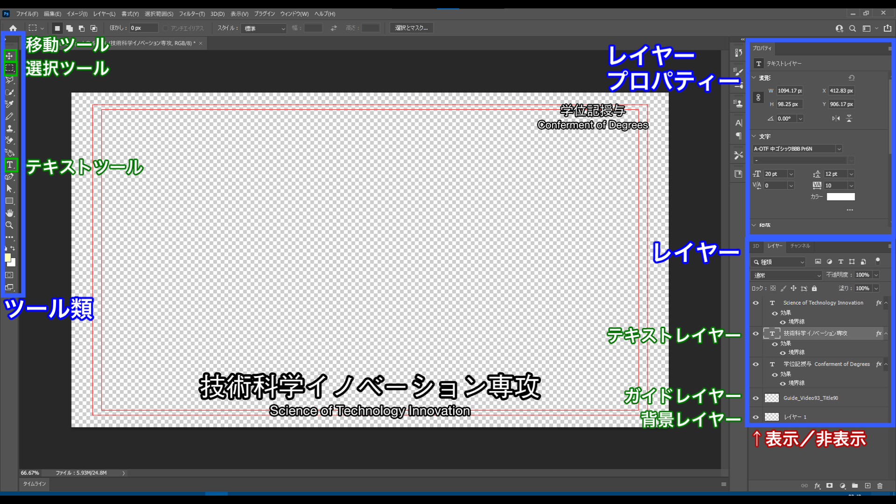
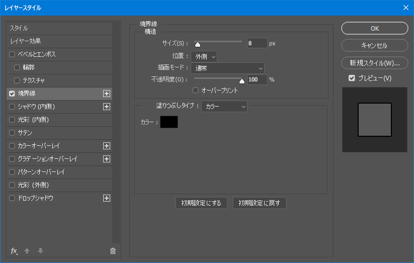

Broadcast  
2021/03/16作成

# 生配信用テロップの作成

ここでは卒業式配信用のテロップ作成を例に，生配信用のテロップの作り方や，注意点をまとめていきます。

## 仕様

スイッチャーに取り込むための代表的な書き出しフォーマットです。

- フォーマット：PNG
- 色空間：sRGB
- 色形式：RGBA
- 色深度：8 bpc（合計32 bits/pixel）
- インターレース：True

## Photoshopでのテロップの作り方

1. Photoshopを起動し，卒業式配信のテロップ用のプロジェクトファイルを開きます。
1. 画面の説明その1です。
	- 主に使うツールは緑文字で示したとおりです。
	- 右上のプロパティータブでは選択しているレイヤーの位置・大きさ・フォントの設定などができます。
	- 右下のレイヤータブでは表示順を上下させたり，レイヤーを非表示にしたりできます。  
	  
	**画像1：Photoshopの画面説明その1**
1. 画面の説明その2です。
	- 右下のレイヤーを右クリックし，「レイヤー効果」を押すと次のような画面が表示されます。
	- ここではレイヤーに様々なエフェクトを設定することができます。
	- 卒業式配信のテロップでは飾りが多いとよろしくないため，境界線（縁取り）を1つ付ける程度になると思いますが，そうでない場合，その状態で境界線の横の＋ボタンを押すことにより，何重にも縁取りをすることができます。  
	  
	**画像2：レイヤー効果**
1. ではここから卒業式配信のテロップ作成の手順を紹介します。
1. 変更したい文字のあるレイヤーを選択し，テキストツールにします。
1. 文字を変えます。
1. ガイドレイヤーを非表示にします。
1. 書き出します。
	1. 左上の「ファイル」
	1. 「別名で保存」（書き出しではない）
	1. 「ファイルの種類」を「PNG」にし，好きな名前で「保存」
	1. 「大きなファイルサイズ」と「インターレース」にチェックを入れ「OK」
1. これを繰り返します。

## 注意点

- テキストツールのまま画像領域をクリックすると新しいレイヤーが作られてしまいます。
	- 新しい位置にテロップを新規作成する場合はそのようにしてください。
	- 逆に今までと同じ位置にテロップを挿入したい場合，新しく作ってしまうと位置やフォントの設定などやることが増えますので，すでにあるテロップを編集した方が良くなります。その場合，テキストツールのまま画面領域をクリックしないようにしてください。
- 同じ位置に表示するテロップの位置は変えないようにしてください。
	- 切替え時に少し位置が変わると目立ちます。
- オーバースキャン領域（後述）に気をつけてください（時と場合による）。
	- 画面の外側が欠ける（拡大される）ディスプレイがあります。
	- 卒業式配信のテロップはガイドの中に入るように配置してください。
- ガイドの非表示を忘れないでください。
	- Premiereとは違い，ガイドもレンダリングされた状態で書き出されます（Photoshop自体にある機能ではなく，独自に挿入したレイヤーであるため）。
- そのパソコンにしか入っていない特殊なフォントはあまり使わないようにしましょう
	- 他のパソコンで編集できなくなります。
	- 基本Adobe Fontsのものを使っておけばAdobe CCが入っているパソコンでは全て使用可能で，権利関係も問題ありません。
	- 私が2017年か2018年に作成した卒業式配信テロップPhotoshopテンプレートをそのまま用いている場合，日本語はAdobe Fontsのモリサワ「中ゴシック」にしましたが，英語は「Helvetica Neue」になっています。Helvetica NeueはMac Proとあすかちゃんにしか入っていませんのでご注意ください。

## オーバースキャン領域について

PCのディスプレイやスマホのディスプレイは画面全体を表示しますが（アンダースキャン），テレビでは画面の外側がはみ出るように拡大された状態で表示します（オーバースキャン）。これはブラウン管が仕組み上 周辺部分が歪んでしまうため，あえて画面の枠ピッタリではなく外側にはみ出して描画していたことに由来し，液晶や有機ELの時代になった今でもその仕組みが残っています。

地デジ完全移行時期（2008年程度以降）のテレビではオーバースキャン領域は5％（表示領域95％）で，ここ数年のテレビ番組もタイトルセーフ（文字を表示しない領域）5％で作られています。しかし，それ以前のテレビ等（例えばマルチの会議室のSDI入力や部室の会議用ディスプレイ（でっかいプラズマ））のオーバースキャン領域は7％で，数年前まではテレビ番組のタイトルセーフは10％でした（少し前のアニメのOP，EDを見るとテロップが画面の端には絶対に来ないことが分かると思います）。

さすがにタイトルセーフ10％で作ってしまうとPC・スマホ等のアンダースキャンディスプレイでテロップがあまりにも内側にあるように感じ，逆にタイトルセーフ0％で作ってしまうとアンダースキャンディスプレイでさえ文字が外側過ぎて圧迫感を感じるため，見栄えや様々な環境を考慮すると**タイトルセーフは5％〜7％程度が最適**かと思います（私個人の感想です）。

ちなみに画像解像度が1920×1080でオーバースキャンが7％のディスプレイの場合，表示領域は1920・0.93×1080・0.93となり，（w，h，x，y）※で表すと（1786，1004，67，38）となります。  
※ w：幅（水平解像度），h：高さ（垂直解像度），x：左上のx座標，y：左上のy座標

