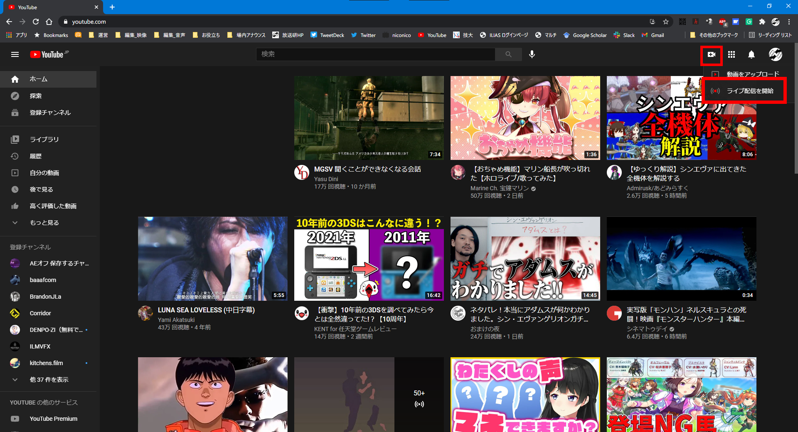
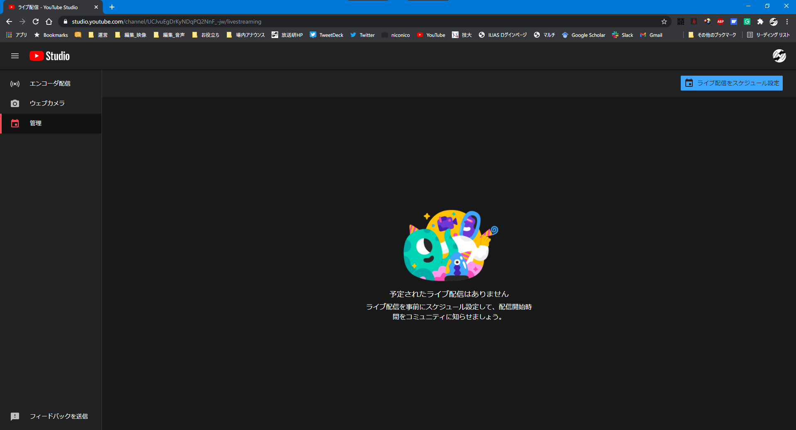
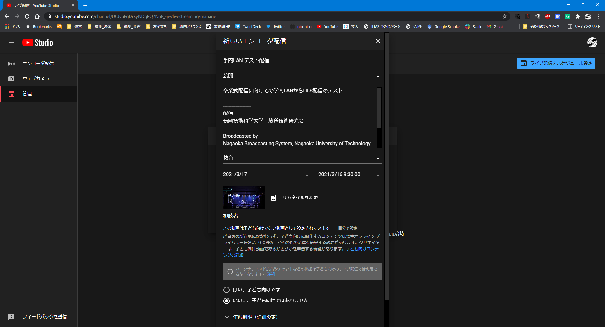
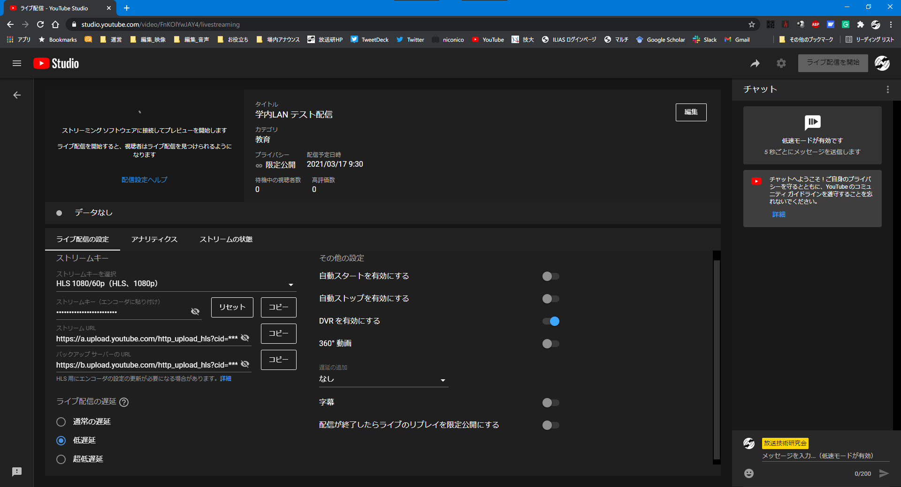
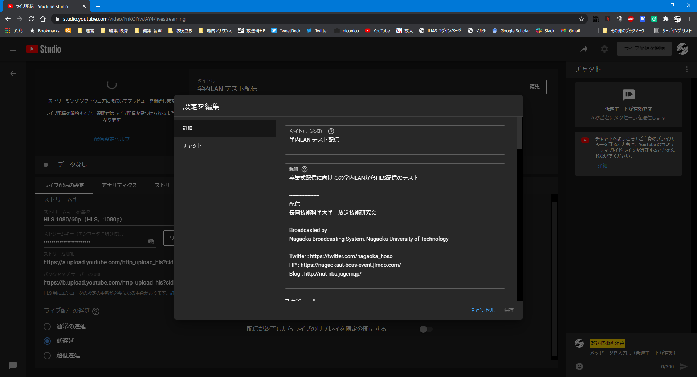
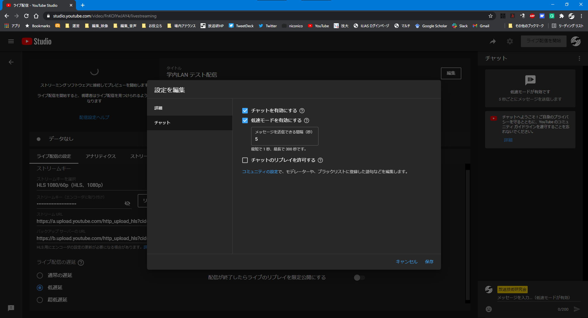
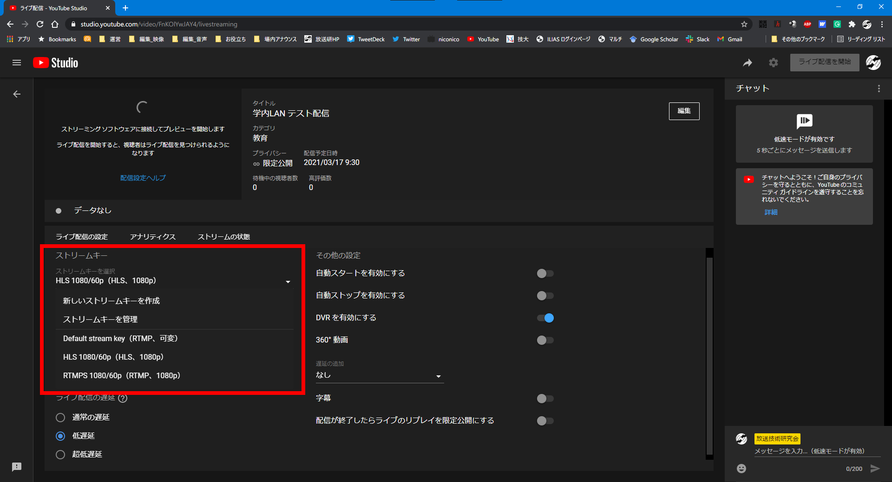
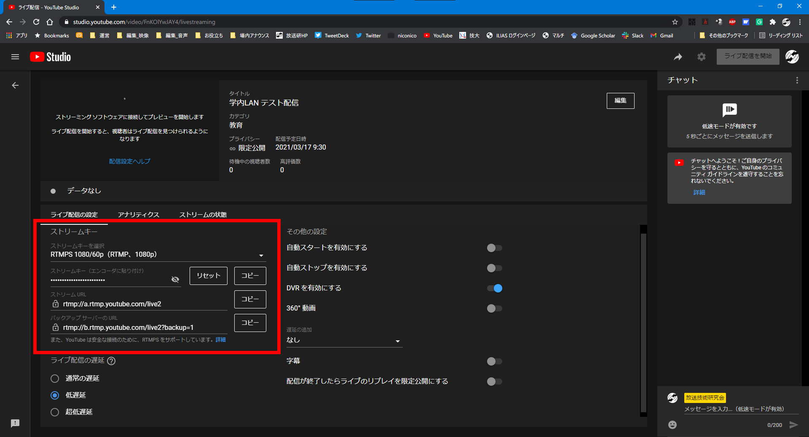
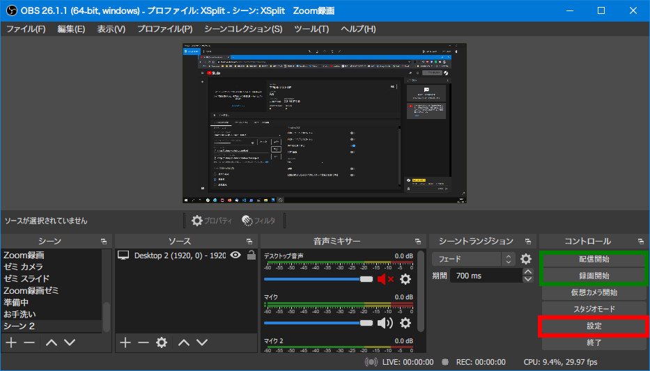
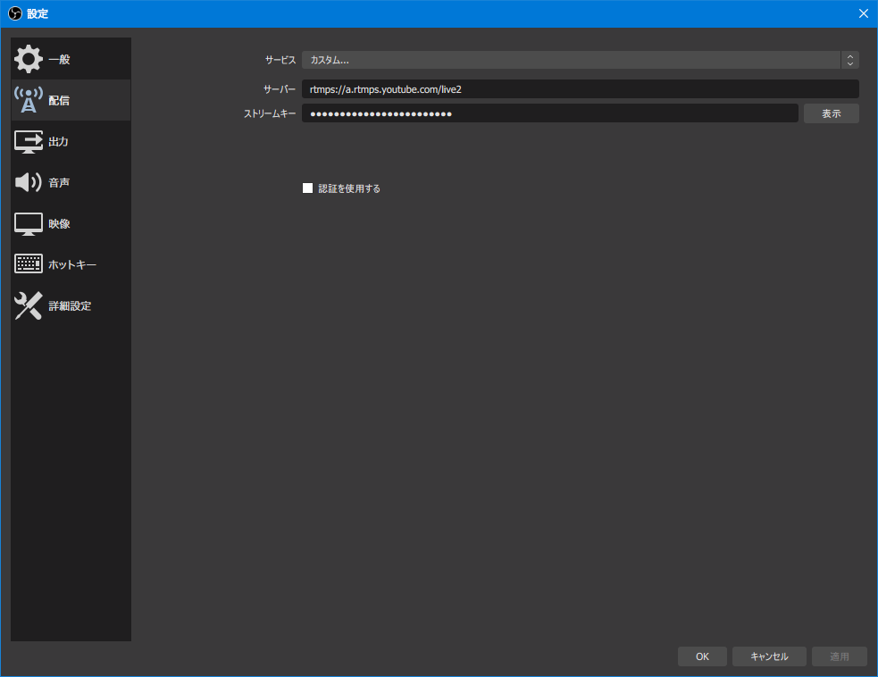

Broadcast  
2021/03/17作成

# YouTube Liveでの配信

ここではYouTubeでの生配信の枠取り（配信予約）や，配信先の設定方法について卒業式配信を例に解説します。

## 枠取り

ここで説明する内容についてはここ数年，毎年YouTubeの仕様変更が行われており，このとおりでないかもしれないのでご注意ください。

1. [YouTube](https://www.youtube.com/)を開きます。
1. 右上にある＋と書かれたカメラマークを押します。  
  
**画像1：YouTubeトップページ**
1. 「ライブ配信を開始」
1. 左のリストで「管理」を選択します。  
  
**画像2：配信スケジュール管理画面**
1. 右上の「ライブ配信をスケジュール設定」
1. 前年の設定が残っていれば，それを再利用すると設定が楽です。
1. 番組の設定画面が表示されるので，各種情報を入力していきます。  
  
**画像3：番組設定画面**
1. このような配信管理画面に移ります。  
  
**画像4：配信管理画面**
	- 注意点
		- 「**ライブ配信の遅延**」で「超低遅延」は選択しないでください。2021年現在，まだ不安定になりやすいです。
		- 「**自動ストップを有効にする**」にしないでください。エンコードを止めるのと同時に配信を終了するオプションです。誤操作で止めてしまったり，回線の問題で止まってしまった後，復帰できなくなりますのでFalseにしてください。
	- その他の説明
		- **ストリームキー**：（後述）
		- **ライブ配信の遅延**
			- 通常の遅延：12秒〜16秒程度（2018年時点）
			- 低遅延：8秒〜10秒程度（2018年時点）
		- **自動スタートを有効にする**：エンコードの開始と同時に視聴者へ映像を流し始めます。Falseにすると右上の「ライブ配信を開始」を押した時点から視聴者へ映像を流し始めます。
		- **DVRを有効にする**：追っかけ再生（例えば最新より3分前を見るなど）ができるようになります。
		- **遅延の追加**：意図的に遅延を追加して視聴者へ映像を流します。オンラインゲームのゴースティング（配信者の操作や役職をリアルタイムで見ることで有利にゲームを進める行為）防止機能です。
1. 右上の「編集」を押します。
1. 「詳細」タブはさきほどよりも設定項目が増えているので，必要に応じて設定しましょう。  
  
**画像5：編集・詳細**
1. 「チャット」タブはチャットの設定ができます。
	- 卒業式配信の場合の注意点
		- 大学戦略課はチャットで変なコメントが付くことを好ましく思っていないようです。
		- 「**チャットのリプレイを許可する**」は**必ずOFF**にしてください（大学戦略課からの指示です）。  
		  
		**画像6：編集・チャット**
1. 編集した状態で「保存」します。
1. これで枠取りは完了です。右上の矢印マークから視聴URLを取得し，卒業式配信の場合，大学戦略課 企画・広報室へメールしてください（大学のWebページに掲載されます）。

## 配信開始

ここからは配信当日に行う設定と，配信開始について説明します。

1. 配信先の設定（配信ソフトへ設定）についてです。配信ソフト（OBS Studio）について，ここに関することは後述し，その他のことは[別記事](./OBSStudioBroadcast.md)にまとめますので，そちらもご覧ください → （未執筆）
	- 大学内から1080/60pで配信する場合
		- 「ストリームキーを選択」を「HLS 1080/60p」へ
		- 配信ソフトの配信先URLを「`rtmp://localhost:11935/NbsYouTubeLive`」へ
		- 配信ソフトのストリームキーを「ストリームキー（エンコーダに貼り付け）」からコピーして貼り付ける。
		- ※ これで，RTMP over SSHでnbs-serverへ配信し，nbs-serverがHLSに変換しYouTubeへアップしてくれます。  
		  
		**画像7：ストリームキーの選択**
	- 大学以外から1080/60pで配信する場合
		- 「ストリームキーを選択」を「RTMPS 1080/60p」へ
		- 配信ソフトの配信先URLを「ストリームURL」からコピーして貼り付け，「rtmp」を「rtmp**s**」に変更する（2箇所）。
		- 配信ソフトのストリームキーを「ストリームキー（エンコーダに貼り付け）」からコピーして貼り付ける。
		- ※ rtmp**s**に変更することによってセキュリティーが向上し，傍受や乗っ取りを防げます。  
		  
		**画像8：ストリームキー**
	- その他の解像度で配信する場合
		- ストリームキーを新規作成してください。
1. 配信ソフトでエンコードを開始してください。
1. 正しくYouTubeへ動画が送られると配信管理画面の右上の「ライブ配信を開始」が赤くなります。そこを押すと視聴者へ映像が流れ始めます。
	- ※ 「自動スタートを有効にする」にしている場合，自動で開始され，その部分は配信**終了**ボタンになりますので，ご注意ください。
1. 左上にプレビューが出ますが，配信しているPCで受信も行うとCPU負荷，GPU負荷，ネットワーク負荷全て高くなりますので，**一時停止しておくことを推奨します**。

## 配信終了

ここからは配信を終了する手順について説明します。

1. まず配信ソフトのエンコードを止め，配信ソフトを終了します（後述）。
	- ※ たまに配信終了後に停止し忘れて放送事故を起こす配信者がいますが，仮にYouTubeに不具合が発生して終了ボタンが反応しなくなったとしても，配信ソフトのエンコードを止め，配信ソフトを終了すれば，**必ず映像・音声は止まります**（送る映像・音声がないため）。そのため，まずはエンコードを止めて，配信ソフトを終了しましょう。
1. エンコード終了後10秒待ってからYouTubeの配信終了ボタンを押します。
	- ※ 10秒程度遅延があるため，すぐに終了してしまうと，最後の10秒程度の映像が**流れなくなります**。

## OBS Studioの配信先の設定

ここではOBS Studioの配信先の設定について説明します。

### 大学内から配信する場合

まず最初に，nbs-serverまでのSSHトンネルを確立します。

1. 左下のWindowsマークを右クリックし，「PowerShell」（管理者で**ない**方）を開きます。
1. 「`.\command\nbs-server.ps1`」と入力し，Enterを押します。
	- 「＼」（バックスラッシュ）は英語入力モードで「￥」を打つと入力できます。PowerShell上では「￥」で表示されます。
	- 途中まで入力してtabキーを押すと補完されます（例えば「.\\com」tab「n」tabで入力できます）
1. 秘密鍵のパスワードが聞かれます。**アレ**です。入力したらEnterを押します。
1. その後何も表示されなければ接続成功です。
1. PowerShellのウィンドウは最小化しても構いませんが，配信が終わるまで**閉じないでください**。

引き続き，↓共通の項目も行ってください。

### 大学内・大学以外 共通

1. OBS Studioを起動し，「設定」を押します。  
  
**画像9：OBS Studio**
1. 「配信」タブへ切替えます。
1. 次のように設定します。
	- **サービス**：「カスタム」
	- **サーバー**：（↑配信開始の項目での配信先URL）
	- **ストリームキー**：（↑配信開始の項目でのストリームキー）  
	  
	**画像10：OBS Studio 配信**
1. 「OK」を押し適用します。

## OBS Studioでのエンコード開始

「配信開始」（↑画像9参照）を押すとエンコードが開始され，エンコードした映像を配信します。ネットワークの不調等により正常に配信できない可能性もあるため，念のため「録画開始」も押しておきましょう（設定によっては自動で録画開始されます）。録画はローカルのビデオライブラリーへ保存されます。配信時にネットワークが不安定だった場合，後から録画した物をアップロードすることもできます。

しかし，スイッチャー等の不調の場合はOBS Studioでの録画では意味がないため，カメラも少なくとも1台は録画しておくことをオススメします。

## OBS Studioでのエンコード終了

### 大学内・大学以外 共通

「配信終了」と「録画終了」してください。

### 大学内から配信する場合のみ

先に↑共通の項目をやってください。

SSH接続を終了します。PowerShellウィンドウでCTRL＋Cを押します。
