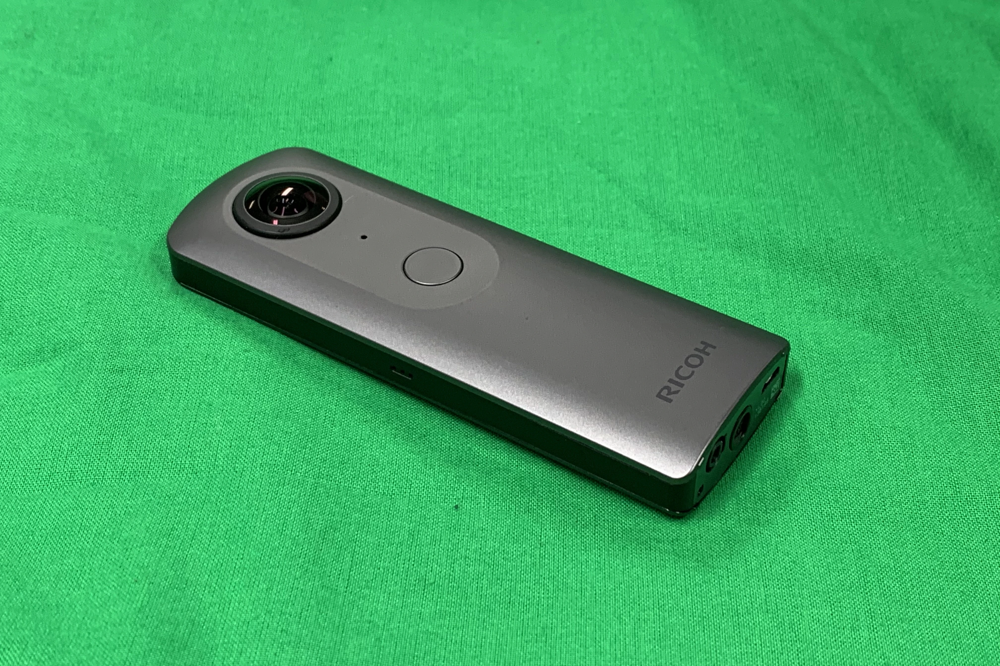
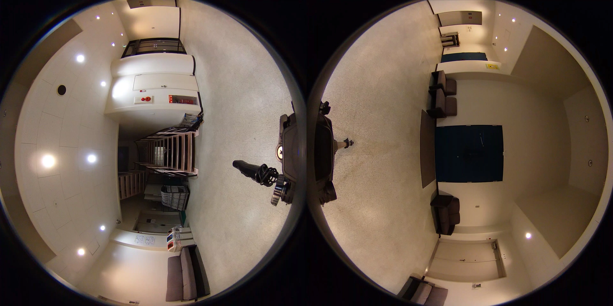
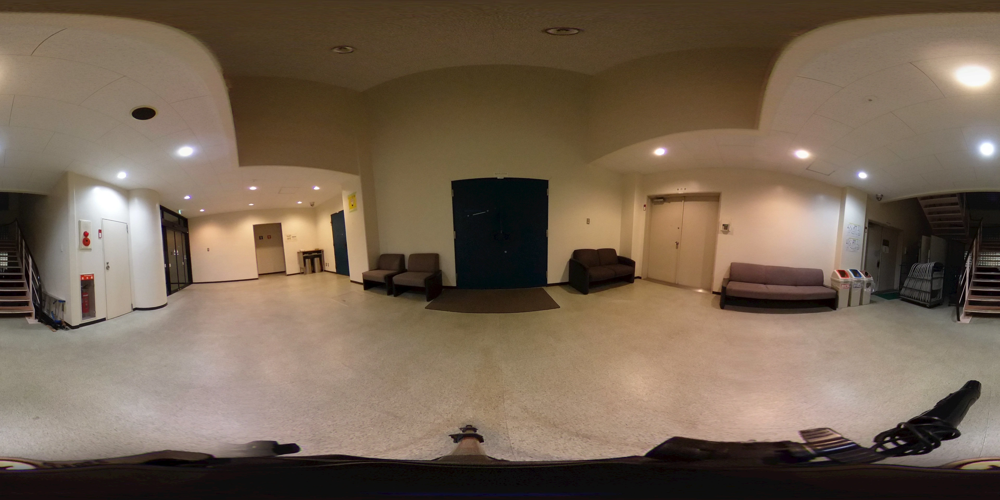
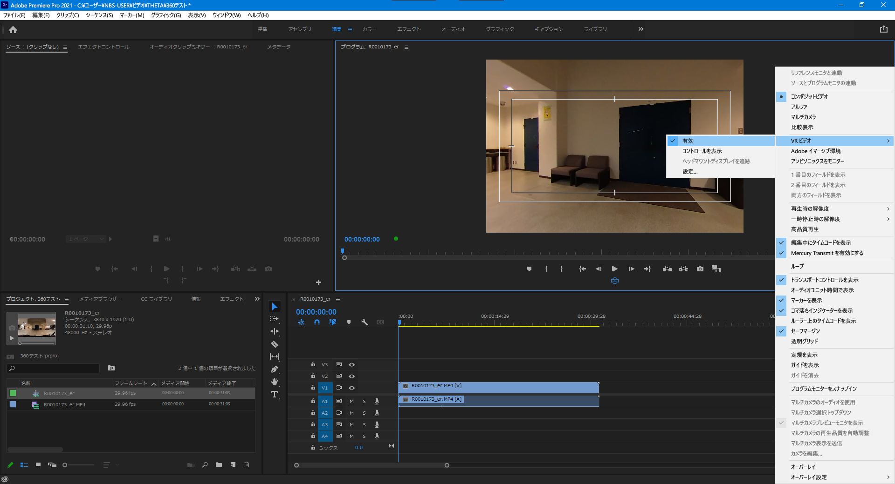

RICOH THETA V  
2021/03/13作成

# THETAって何？

## 概要

表・裏 両面に魚眼レンズが付いており，360°撮影できるようになっているカメラです。個人でも手軽にGoogleのストリートビューのような写真や動画を撮影することができます。

  
**画像1：THETA V**

## 撮影の仕方と注意点

別記事にまとめました → [スマホでの設定と映像の確認](./SettingUpAndCheckingImageWithYourSmartphone.md)

また，0°（動画再生したときの最初の向き，正面）は**ボタンがない方の面**です。編集で正面の向きを変えることもできますが，撮影時に正面を合わせておくと編集が楽になります。

## 編集前の注意事項

YouTubeやその他多くの360°動画対応プレイヤーで再生する際，正距円筒図法（方眼図法とも，詳しくはWikipedia → [https://ja.wikipedia.org/wiki/正距円筒図法](https://ja.wikipedia.org/wiki/正距円筒図法)）である必要があります（2021年現在）。THETAの録画データ（元データ）は2つの魚眼レンズでの映像がそのまま記録されており，事前に変換する必要があります。また，変換前に編集してしまった動画から変換することは**できません**ので，**必ず編集前に変換しておきましょう！**　※ 私は過去にやらかしました。

変換前後の見え方の違いです。

  
**画像2：THETAの撮影データ**

  
**画像3：正距円筒図法に変換したデータ**

## THETAでの撮影データを正距円筒図法へ変換する

[パソコン用アプリケーションの「基本アプリ」（外部リンク）](https://support.theta360.com/ja/download/)を用いて変換できます。変換には時間がかかります。

## 変換した動画を編集する

正距円筒図法は球面を平面（2D）に投影したものですので，当然普通に動画編集ソフトで編集できます。Premiere Pro CCの場合（他の対応ソフトもそうですが），正距円筒図法から球面に再構築した状態（YouTube等で再生するときの見え方）でプレビュー表示することもできます。やり方としてはプログラムビュー付近の設定から「VRビデオ」→「有効」にチェックを入れます。

  
**画像4：Premiere Pro CCでの360°プレビュー**

また，THETAが魚眼レンズであることや，正距円筒図法に変換していることから上下（天頂と地面）は歪みやすくなります。特に地面は撮影者・三脚等の映り込みもありますので，**必要に応じて ぼかしましょう**。Googleのストリートビューでも地面はぼかされています。

## 編集した360°動画をYouTubeへ投稿する際の注意点

さきほども書きましたが，正距円筒図法に変換した後は通常の2D動画です。そのまま書き出し，投稿してしまうと正距円筒図法のまま再生されてしまいます（VRとか言いながら正距円筒図法のままになっている残念な動画もたまに見かけます）。そのため，YouTubeへ投稿する際に360°動画であることを知らせなくてはなりません。

そのための方法は頻繁にアップデートがあるので，YouTube公式のヘルプを確認しましょう（「YouTube　360°」などで検索）。また，動画ファイルにメタデータを入れなければならない場合はAdobeのヘルプも見ておきましょう（Premiere Pro CC，After Effectsで編集した場合）。

なお，2021年現在，Premiere Pro CCの出力時の設定で「VRビデオとして処理」のチェックを入れるとYouTubeでも認識されるようです。
