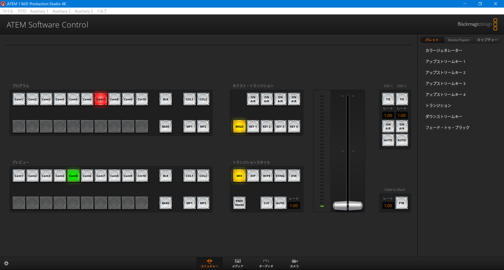
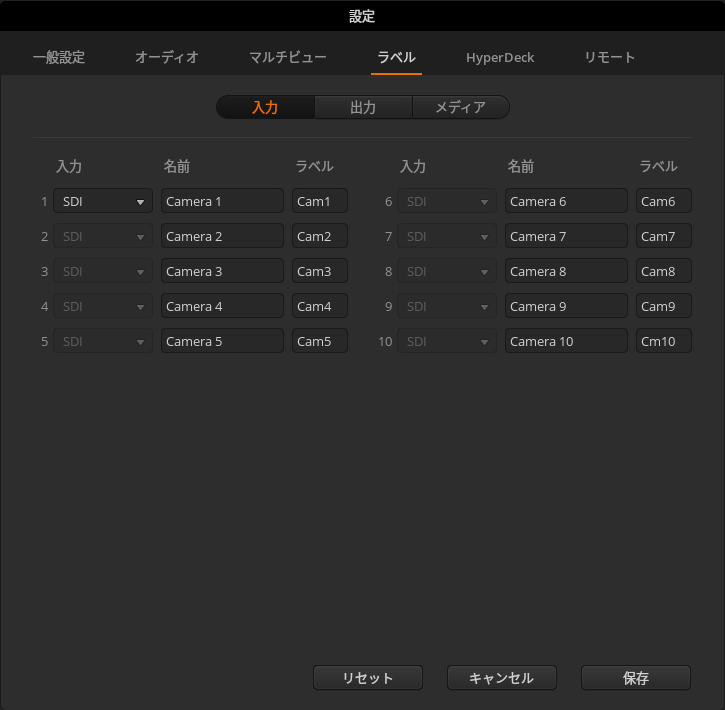
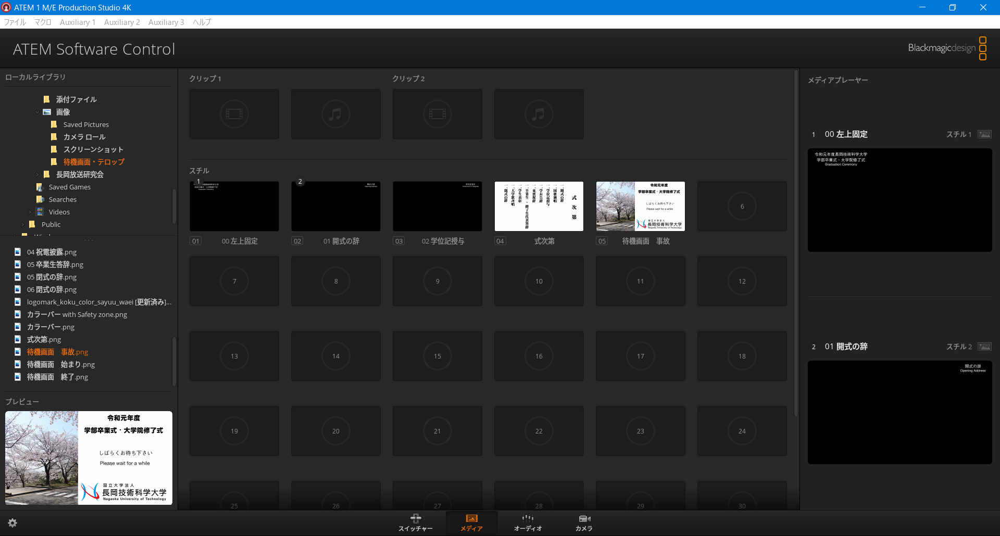
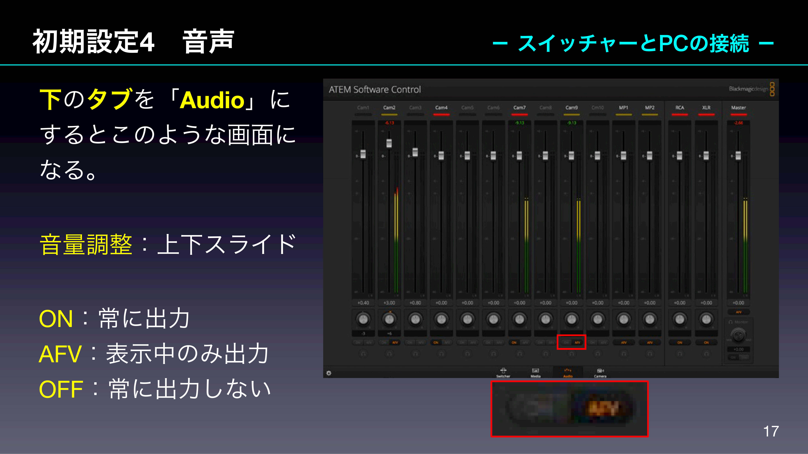
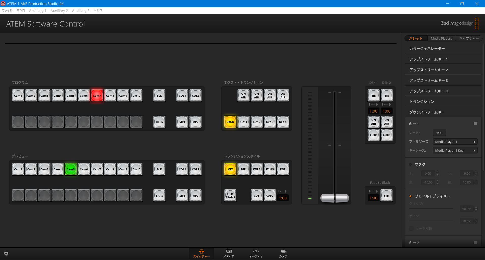
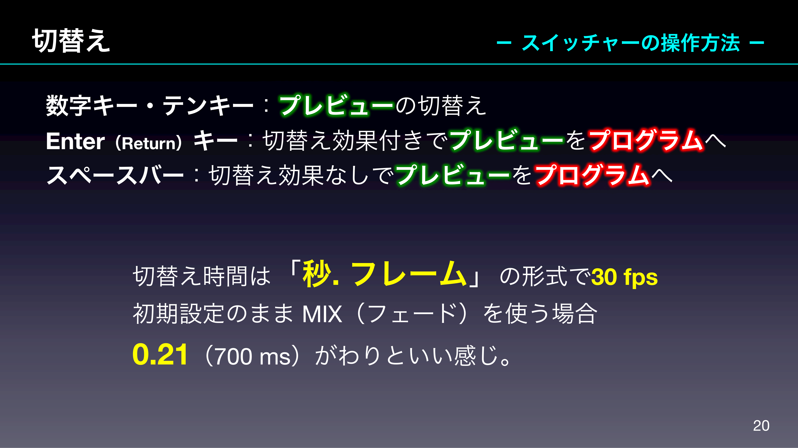
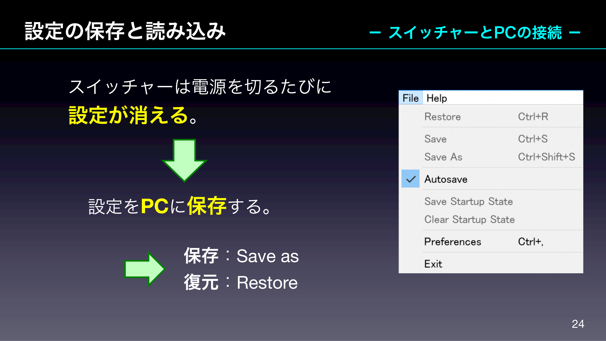

Broadcast  
2021/03/21作成

# スイッチャー（ATEM 1 M/E Production Studio 4K）

ここではATEM 1 M/E Production Studio 4Kというスイッチャーの使い方についてまとめておきます。

## 概要

スイッチャーは複数のカメラ入力から最適な絵を1つ（あるいはワイプ等で複数）選び，画面に出力する装置です。

本体にはたくさんのSDI端子が付いています。それぞれ近くに名称が書いてありますが，カメラは入力，全てのカメラの映像の一覧の出力はマルチビュー，最終出力はプログラムです。

その他，テロップの挿入やクロマキー合成も専用回路で遅延なく行うことができます。

## 注意点

- このスイッチャーの仕様なのか，それともたまたま不良品なのか分かりませんが，HDMIの信号レベルがおかしいです。入力・出力ともに**HDMIは一切使わない方が無難**です。
	- 平成30年度の卒業式配信（[https://youtu.be/qUvtblGpftc](https://youtu.be/qUvtblGpftc)）の映像がチラついているのが分かると思います（特に明るい絵のとき）。これはスイッチャーのHDMIプログラム出力を直接HDMIキャプチャーへ入れたためです。この後の配信ではSDI出力をHDMI変換器を通してからHDMIキャプチャーへ入れ，問題なく配信できています。
	- またそのとき（平成30年度の卒業式のとき）は暗いときはあまりチラツキが起こらなかったため，式が始まってから問題に気づきました。しかし，最低限の機材しか会場に運んでおらず，SDI出力からHDMIに変換するというような代案を試すことはできませんでした。なので，配信に行くときは**多少は予備の変換器やケーブルがあると良い**です。
- スイッチャーの制御アプリでは3G-SDIのレベルに関してLevel Bが標準と書かれていますが，放送研の機材は**Level A**を採用しています。Level BにしてしまうとSDIも使えなくなってしまいます。
- スイッチャーとルーター，ルーターと制御PCの間はなるべく有線を使いましょう。
	- 最近は新型コロナウイルス対策で人が集まる所での配信をしていないので無線でも大丈夫かもしれませんし，今後コロナ前のような人が密集する状態での卒業式などが開催されるのか分かりませんが，もし以前のような配信をする場合，意外とモバイルWi-Fiを持っている人も多いものです。Wi-Fiで繋いでしまうと電波が干渉してうまく通信できなくなります。
	- 特にUDPの通信で，通信状況が悪くても再送とかできないので致命的になります。
	- この問題は平成29年度（？）（市立劇場が工事中でハイブ長岡で行ったとき）に顕著に起こりました。
- スイッチャーにリサイズ機能は付いていないため，スイッチャーの形式と信号の形式が同じ出ないと入力できません。例えば1080/60pに設定したら，入力（カメラ）も全て1080/60pにしなくてはいけません。そこまで高級品ではないので。
- 本体のファームウェアと制御アプリのバージョンが揃ってないと通信できないことがありました。アップデートは同時に行いましょう。
- 設定は基本毎回リセットされるので，必要に応じてPCに設定のバックアップを取っておいてください。

## 制御アプリのインストール or アップデート

1. セキュリティーソフトの設定をかなり厳しくしている場合は192.168.0.0/16への外向き9910/UDP，13823/UDPが通るようにします（外向きなので通常は通るようになっているはずですが）。
1. 制御アプリをダウンロードします。
	- Blackmagic Designのサポートセンターのサイト（[https://www.blackmagicdesign.com/jp/support/](https://www.blackmagicdesign.com/jp/support/)）へ行きます。
	- 「製品シリーズを選択」で「ATEMライブプロダクションスイッチャー」を選択します。
	- 「最新のダウンロード情報」の「ATEMスイッチャーx.xアップデート」からダウンロードします。
		- 新規インストールの場合もアップデートで問題ありません。
1. ダウンロードした物を開き，インストールします。
1. インストールされた「ATEM Software Control」を開きます。
1. IPアドレスの入力が求められたらスイッチャーのIPアドレスを入力します。本体に養生テープでIPアドレスが書かれています。

## 制御アプリの使い方

### ① フォーマットの確認

前述したとおり，フォーマットが合っていないと映像の入出力ができません。なので，起動したらまずフォーマットを確認します。起動したら次のような画面になってると思うので，一番左下の歯車マークを押します。

  
**画像1：制御アプリ起動後**

すると次のような設定画面が表示されます。

  
**画像2：一般設定**

左上「一般設定」のタブを開き，

- **ビデオフォーマット**を「1080p59.94」へ
- **3G SDI出力**を「レベルA」にします

ビデオフォーマットの右にある「設定」を押すと反映されます。

  
**画像3：ラベル**

次に「ラベル」のタブでは入力1をSDIにするかHDMIにするか選択できます。前述の通りHDMIは不安定なので，SDIにしておきましょう。

### ② テロップの読み込み

画面下中央を「メディア」タブにするとこのような画面になります。

  
**画像4：メディア**

静止画テロップデータは「スチル」の1，2，3，……と並んでいるところへ放り投げていくとスイッチャーへ画像が転送されます。

### ③ 音声設定

  
**画像5：オーディオ**

卒業式配信の場合，RCAまたはXLR（ミキサーが繋がっている方）とMasterのみONで，その他は全てOFFでいいです。

## ④ クロマキー用上流（アップストリーム）キーの設定

（最近使ってなかったので後で追記します）  
（卒業式配信では使わないので安心してください）

【要画像】  
**画像6：アップストリームキー**

### ⑤ テロップ用下流（ダウンストリーム）キーの設定

  
**画像7：ダウンストリームキー**

「スイッチャー」タブに戻り，右の「パレット」を表示します。画像のようにキー1を

- **フィルソース**：Media Player 1
- **キーソース**：Media Player 1 Key

にし，キー2は同様にMedia Player 2にします。

下のプリマルチプライキーはテロップやテロップ表示時のカメラがおかしくなるときに調整してください。

### ⑥ カメラの切替え方法

  
**画像8：切替え説明スライド1**

  
**画像9：切替え説明スライド2**

### ⑦ テロップの切替え方法

【要画像】  
**画像10：Media Players**

テロップに使う画像（メディアプレイヤーで表示する画像）の切り替えはパレットの隣のMedia Playersから切替えられます。

テロップ自体の表示ON／OFFはDSKのON AIRボタンで切替えられます（画像8参照）。

## 設定の保存

  
**画像11：保存説明スライド**

