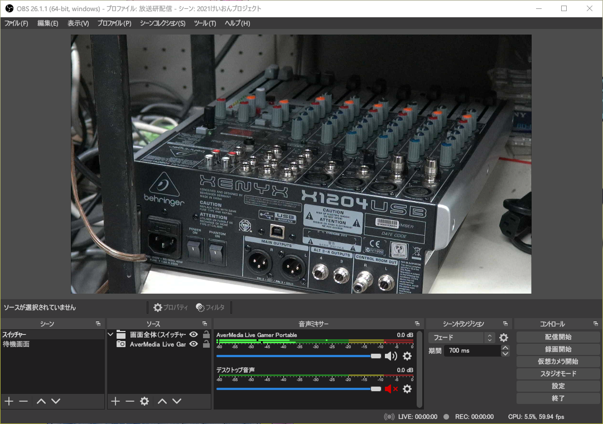
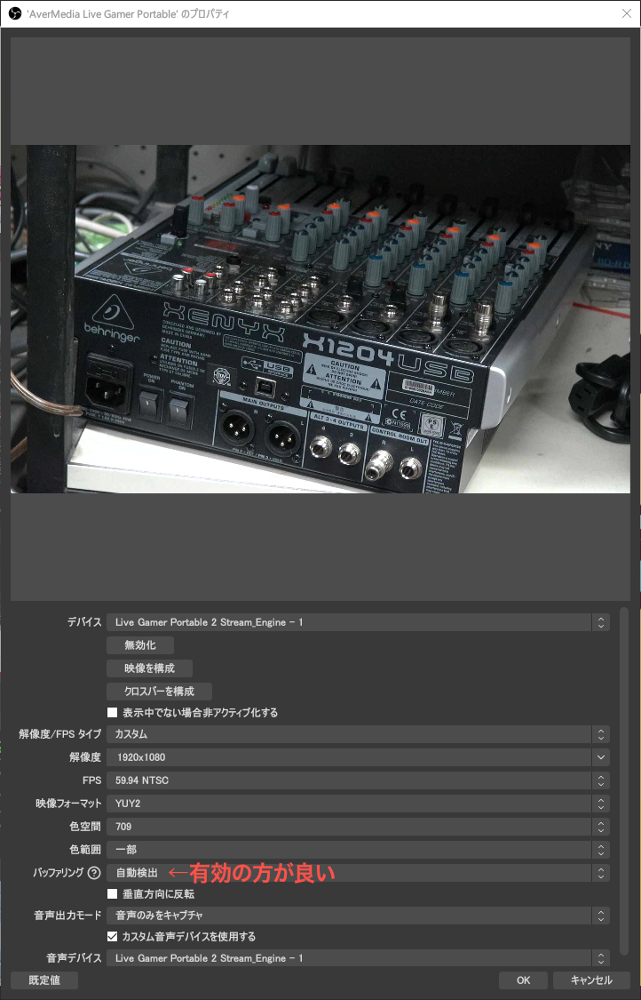
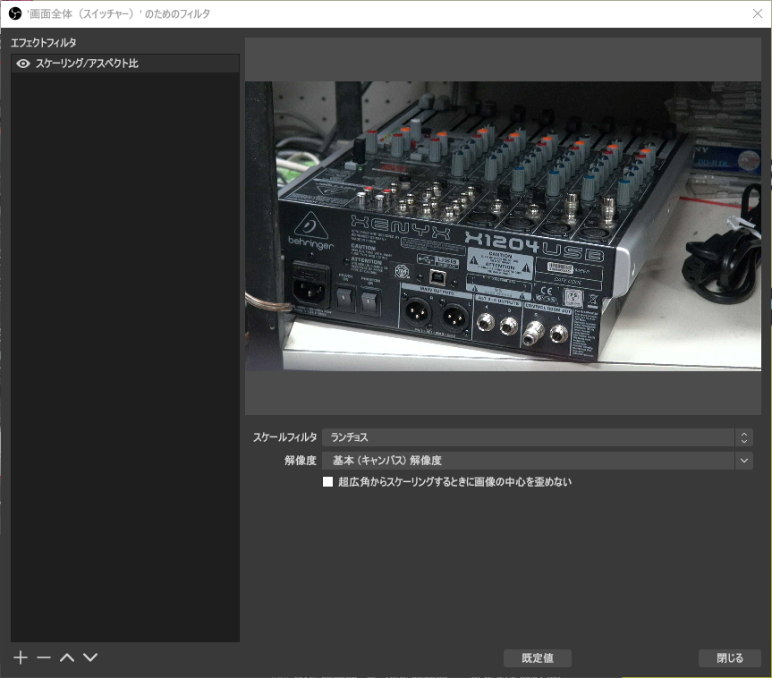
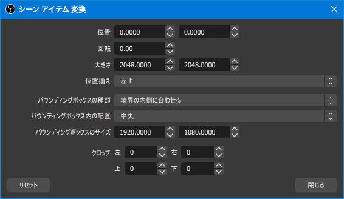
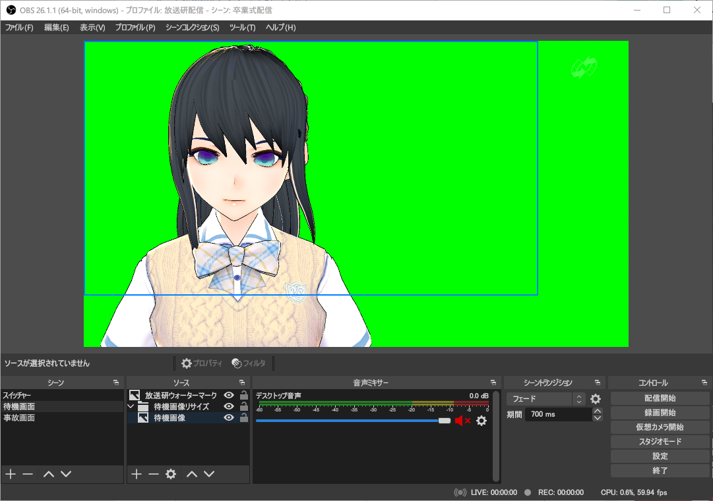
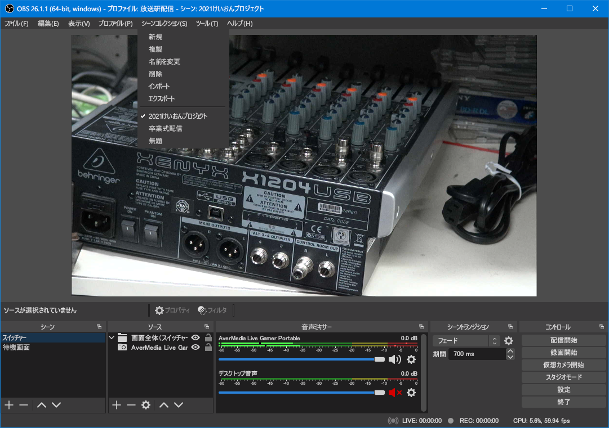
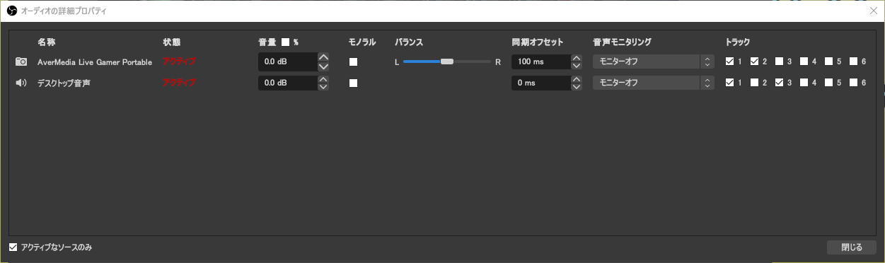
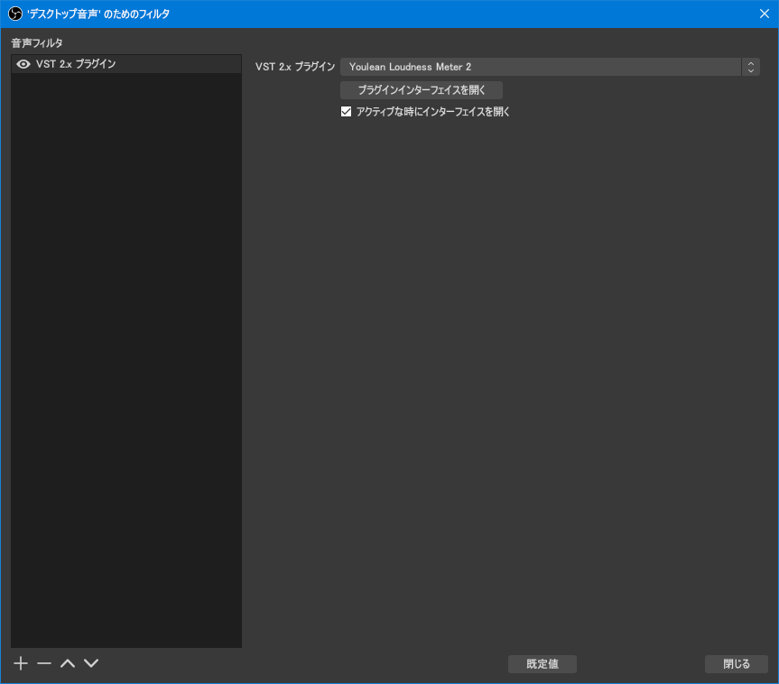
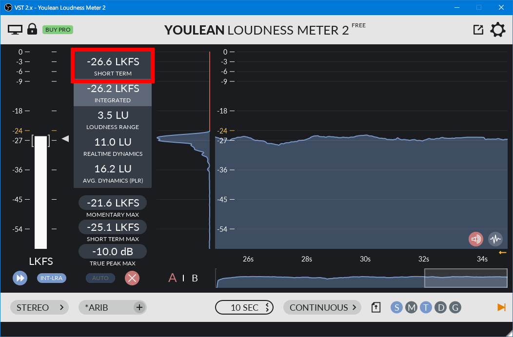

Broadcast  
2021/03/20作成

# OBS Studioでの配信

ここではOBS Studioの使い方，配信の仕方などを説明していきます。主に配信当日に行うものです。事前設定については[OBS Studioの設定](./OBSStudioSetting.md)をご覧ください。

## 概要

起動後の画面と，説明です。

  
**画像1：OBS Studio**

- **シーン**：スイッチャーのそれぞれのカメラ入力をソフト的に再現した物です。入力1，入力2，……と作っておき，ワンタッチで切替えられます。
- **ソース**：選択しているシーンを構成する映像や音声です。画像編集ソフトと同様にレイヤー構造になっており，上に書かれているソースが画面の上側に表示されます。
- **プロパティ**：選択しているソースの詳細設定ができます。
- **フィルタ**：選択しているソースに映像・音響効果をかけます。
- **音声ミキサー**：音声をミキシング（重ね合わせ）します。
- **シーントランジション**：シーンを切替えるときの切替え効果です。
- **コントロール**：各種操作ができます。
- （メニューバー）**プロファイル**：OBS Studioの状態を丸々保存・復元します。
- **シーンコレクション**：全てのシーンを保存・復元します。

## ソースのプロパティ

ソースを選択し，プロパティを押すと，入力の設定ができます。

マルチメディアシステムセンターのスイッチャー（ATEM）につないだHDMIキャプチャー（AverMedia Live Gamer Portable 2）を入力する場合，必ず次の画像のように設定してください（**バッファリングは有効**の方が良いです）。その他のデバイス（Webカメラ等）は自動でいい感じにしてくれると思うので，おかしな時だけ変更する形で良いと思います。

  
**画像2：キャプチャーのプロパティ**

注意点としては次のとおりです。

- **デバイス**は「Stream Engine」と付いているものにしてください。Live Gamer Portable 2だけのものだと映像フォーマットをH.264にすると頻繁にコマ落ちが発生し，MotionJPEGにすると画質が劣化します。
- **色空間**は「709」にします。[事前設定](./OBSStudioSetting.md)の方では601にしましたが，それはOBSの出力の話で，ここで設定するのは入力の話です。カメラやスイッチャーはBT.709なので，709を選択します。
- **音声デバイス**はひとつ上の「カスタム音声デバイスを使用する」にチェックした上で，デバイス名と同じ物（Stream Engineと付いている物）を選択します。

## ソースを画面ぴったりに表示したい

画面に画像を表示させたいことはよくあると思います。しかし，画像ファイルを変えると大きさが変わってしまったり，OBS Studioの設定で基本解像度を変えると大きく位置が変わってしまったりします。

XSplit Broadcasterではワンクリックでぴったりの大きさに変更でき，解像度を変えても画面ぴったりのままになりますが，OBS Studioではひと手間かかります。

1. シーン中に「グループ」ソースを作成します。
1. そのグループのフィルタ設定を開き，次の画像のように「スケーリング／アスペクト比」エフェクトを追加し，解像度を「基本（キャンバス）解像度」にします。  
  
**画像3：グループフィルタ**
1. 画面ぴったりに表示したいソース（画像等）をグループの中に入れます。
1. この時点では画像のアス比が崩れてしまいます（もともと16：9の画像であれば問題ないですが）。
1. さきほどグループの中に入れたソースを右クリックし，「変換」→「変換の編集」と進みます。
1. 次のような画面が出るので，「**バウンディングボックスの種類**」を「境界の内側に合わせる」にし，「**バウンディングボックスのサイズ**」を「1920×1080」等16：9になるようにします（なるべく基本解像度に揃えた方が画質が良くなります）。  
  
**画像4：アイテム変換**
1. 最終的に次の画像のように画面にぴったり合うようになり，設定から基本解像度を変更しても画面ぴったりの状態が維持されます。  
  
**画像5：画面ぴったりに画像が表示されている様子**

このようにスケーリングエフェクトを適用させたグループと，ソースの変換を用いることで，複数ソースの位置関係を固定することもできます。（そもそもXSplitやアプリ開発フレームワークみたいにOBSも相対座標導入しろって個人的には思いますけどね）

## シーンを保存したい

「シーンコレクション」を使いましょう。

  
**画像6：シーンコレクション**

## 音声周り

OBS Studioは音声周りの自由度と複雑度がえぐいレベルですが，解説していきます。

### ① 音声ミキサー

  
**画像1（再掲）：OBS Studio**

それぞれの音声ソースの音量を調整し，音量バランスを調整します。スピーカーマークを押すとミュート（消音）にできます。

単位はスライダーがdB，音量メーターがdBFSです。dは国際単位系接頭辞で×0.1の意味のデシです。Bは比率を常用対数（底10）で表すときの単位ベルです。FSはフルスケールの略で，比率の基準が最大値であることを表します。よって，スライダーは0 dBが入力のままの音量で，メーターは0 dBがデジタルで表現できる最大の音量となり，-6.02 dBするごとに絶対音量は1/2になります（-12.04 dBで1/4，-18.06 dBで1/8，……）。しかし，人間の感覚も対数特性（音量が小さいときは音量の変化に敏感で，音量が大きいときは音量の変化に鈍感）なので絶対音量は考慮せずにdBのまま調整した方が自然になります。

### ② オーディオの詳細プロパティ

音声ミキサーの何かしらのソースの横の歯車マークを押し，「オーディオの詳細プロパティ」を開くと，次のような画面が表示されます。

  
**画像7：オーディオの詳細プロパティ**

- **音量**：音声ミキサーの前段で音量を増減できるようです。
- **同期オフセット**：音声が早く流れるソースがあれば遅延させることができます。AverMedia Live Game Portable 2 Stream Engineは実験してみたところ100 ms程度音声が早かったため，100 msに設定しています。
- **音声モニタリング**：[設定編](./OBSStudioSetting.md)のモニタリングデバイスへ音声を流すか／流さないか，モニタリングデバイスのみに流し配信には流さないか，の3択です。  
特に動画を流すとき，メディアソースは標準ではPCから音声が流れないため，モニタリングデバイスをPCのスピーカーに設定し，この項目を「モニターのみ」にし，デスクトップ音声を配信するようにするなどとした方が良いです。  
逆に，モニタリングデバイスはPCのスピーカーとは別にし，配信とモニター両方に出力したいという場合もあるため，この項目の設定は普通に頭を使います。  
当然，モニタリングデバイスがPCのスピーカーの時は，モニターと配信に両方に流すようにしてるにもかかわらずデスクトップ音声も配信する場合音割れやタイミングがズレて2重に聞こえるなどの問題が起こるので**注意が必要**です。デスクトップ音声をモニターしてしまうとハウリングし不快な音になる可能性もあるため，**注意しましょう**。  
大事なことなのでもう1回言いますが，この項目はかなり頭を使います。
- **トラック**：何番トラックにどの音声を流すか設定します。[設定編](./OBSStudioSetting.md)の出力の項目でも軽く触れましたが，トラックとは主音声・副音声的なアレです。個人的にはトラック1は全てのソースにチェックを入れ，配信の出力をトラック1にし，トラック2以降はそれぞれひとつずつチェックを入れることをオススメします。そうすると，録画した動画を普通に再生したときは全ての音声がミックスされた配信と同じ音声が再生され，さらに音量バランスが悪いところがあっても，それぞれのソースがそれぞれのトラックに記録されているため，動画を再編集するときに再調整することができるようになります。

### ③ 音声フィルタ

音声ミキサーのフィルターをかけたいソースの横の歯車マークを押し，「フィルタ」と進むと，次のような画面が表示されます。

  
**画像8：音声フィルタ**

ここではVST2プラグイン，コンプレッサー，ノイズゲートなどをかけることができます。個人的にオススメなフィルターは次の通りです。

- 卒業式配信のキャプチャー：コンプレッサー
- ゲーム実況のマイク：ノイズゲート，コンプレッサー（ノイズゲートが上）

#### コンプレッサー

大きい音はそこまで大きくせず，小さな音は増幅させ，そこまで小さくしない，というフィルターです。人の声がメインのソースの場合，しゃべり声はマイクを通すとわりと音量差が出てしまうため，軽くコンプレッサーをかけた方が聞き取りやすくなります（デフォルト設定のまま大きくかけるとかえって聞き取りづらくなるため注意）。

OBSのコンプレッサーはあまり使っていないので多少調整する必要があるとは思いますが，声ソースの場合，だいたい次のような設定が良いです。

- **比率**：3：1程度
- **閾値**：その場のノイズレベルにもよるが-30 dB前後
- **アタックタイム，リリースタイム**：それぞれ500 ms以上

#### ノイズゲート

普通の環境で録音した場合，どうしてもサーというノイズが小さく乗ります。しゃべっているときは声の方が圧倒的に大きいため気になりませんが，しゃべっていないときはサーという音が気になってしまいます。そこで，ある一定の音量に達していない間は自動的にミュートしノイズを目立たなくします。名前が似ているので注意が必要ですが，「ノイズ抑制」とは**全くの別物**です。抑制の方は音質に影響があるため，あまり使わない方がいいと思います。

これも環境によりますが，閾値はそれぞれ35 dB〜45 dBあたりでいいと思います。

### ④ ラウドネスメーター

これはOBS Studioの機能ではなく，「Youlean Loudness Meter 2」というVST2プラグインの説明です。このプラグインはメーターであり，実際に音の加工はしません。

ラウドネス（直訳＝うるささ）とは物理的な音量ではなく人間の聴覚の特性を反映させた音量のことです。ピークメーターでは人間が聞こえる音量とかなり差があるため，ラウドネスを測ることをオススメします。また，デジタルでの音響制作では0 dBFS（最大音量）を超えないようにピークメーターも監視するのが一般的ですが，ラウドネスが－24 LKFS程度になるように調整すれば基本的に0 dBFSに達しないため，個人的にはピークメーターを見ずにラウドネスメーターだけ見てもいいと思います。

フィルターで一番下に「VST 2.xプラグイン」を追加し，「Youlean Loudness Meter 2」を選択し，「プラグインインターフェイスを開く」を押すと次のような画面が表示されます。

  
**画像9：ラウドネスメーター**

設定する項目は1番下です。

- **左から2番目**：アルゴリズムを指定します。「ARIB TR-B32」にします。これは日本のテレビ放送で用いられているアルゴリズムです。
- **左から4番目**：表示方法を指定します。OBS Studioから使う場合「CONTINUOUS」にしないと動作しません。

あとは，ミキサー担当の人は赤枠で囲ったところ「SHORT TERM」の値が－24 LKFS前後になるように調整してください。なお，－24 LKFSはテレビの基準であり，音楽ストリーミングサービスなどは－18 LKFSに正規化しています（映画は音量の大小を付けるために－27 LKFS程度と言われています）。これらの範囲を基準にすれば問題ないのですが，0 dBFSに達しないようにする観点からも生配信のときは-24 LKFSを目指すように調整するのが良いと思います。SHORT TERMは名前の通り，短い時間での平均値で，調整したばかりの音量が数値として表れるため，分かりやすいと思います。

ちなみに，その下のINTEGRATEDは最初から全ての期間での平均値で，その下3つは音量差
に関する指標です（そこは特に気にしなくてもいいです）。また，さらにその下にある「TRUE PEAK MAX」というところで0 dBFSに達していないかどうか確認することができます。

## 配信先を設定する

設定→配信 のところです。

[YouTube Liveでの配信](./YouTubeLive.md)にまとめていますので，そちらをご確認ください。

## 情報速度を決定する

配信する場所のネットワーク状況に応じて最適な情報速度（ビットレート＝画質）を決定します。

設定箇所は設定→出力→（配信タブ）→「目標ビットレート」と「最大ビットレート」です。「目標ビットレート」はこれから説明する方法で決定し，「最大ビットレート」は「目標ビットレート」の1.5倍〜2倍に設定します（ネットワーク安定性重視→1.5倍，画質重視→2倍）。

通信速度を測るアプリやWebサービスは瞬間最大速度しか測れませんが，配信では安定的にそこそこの速度を維持する必要があるため，そのようなアプリ・サービスの値は参考になりません。そこで，本配信開始前に数分間映像を流すことをオススメします。そこで問題があれば情報速度を小さくします。

### 情報速度（目標ビットレート）早見表

とはいえ，最初に設定する値がいい感じのところでないと，しらみつぶしになってしまい，本配信開始までに適切な値を見つけられません。そこで，情報速度早見表を作りましたので（私のオリジナルです），参考にしてください。ただし，**超**重視系はもう一方を無視した値なので，あまり使わない方がいいです。

- **1080/60pで配信する場合**
	- 画質超重視：12,000 kbps（5.4 GB/時）
	- 画質重視：8,000 kbps（3.6 GB/時）
	- ネットワーク安定性重視：6,000 kbps（2.7 GB/時）
	- ネットワーク安定性超重視：4,000 kbps（1.8 GB/時）
- **1080/30pで配信する場合**
	- 画質超重視：9,000 kbps（4.0 GB/時）
	- 画質重視：5,000 kbps（2.2 GB/時）
	- ネットワーク安定性重視：4,000 kbps（1.8 GB/時）
	- ネットワーク安定性超重視：3,000 kbps（1.4 GB/時）
- **720/60pで配信する場合**
	- 画質超重視：6,000 kbps（2.7 GB/時）
	- 画質重視：4,000 kbps（1.8 GB/時）
	- ネットワーク安定性重視：3,000 kbps（1.4 GB/時）
	- ネットワーク安定性超重視：2,000 kbps（0.9 GB/時）
- **720/30pで配信する場合**
	- 画質超重視：6,000 kbps（2.7 GB/時，なお2021年現在のニコ生の推奨値）
	- 画質重視：3,000 kbps（1.4 GB/時）
	- ネットワーク安定性重視：2,000 kbps（0.9 GB/時）
	- ネットワーク安定性超重視：1,500 kbps（0.7 GB/時）

## 配信開始する

  
**画像1（再掲）：OBS Studio**

「配信開始」を押してください。
